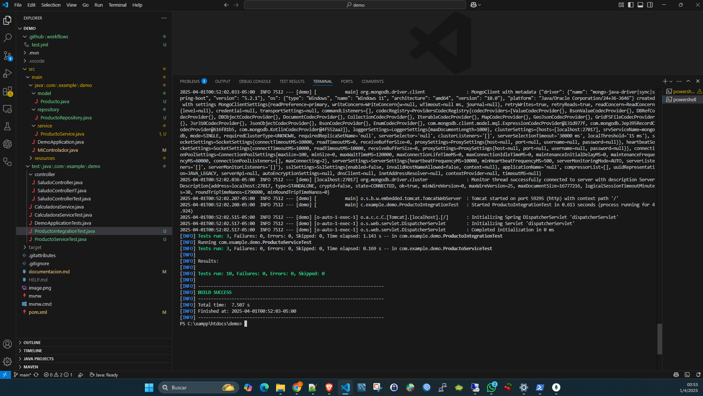

# Evaluación de Automatización de Pruebas y Configuración del Entorno

## 1. Configuración del Entorno
- Se instaló Maven y se configuró el proyecto con JUnit 5 y Spring Boot Test.
- Se agregaron las dependencias necesarias en `pom.xml` para pruebas unitarias, integración y automatización.
- Se configuró MongoDB como base de datos para el proyecto.

## 2. Pruebas Implementadas

### Pruebas Unitarias con Mockito
Se crearon pruebas unitarias para la clase `ProductoService`, simulando el comportamiento del repositorio con Mockito. Estas pruebas validan los siguientes métodos:
- `listarProductos()`: Verifica que se devuelvan todos los productos.
- `obtenerProductoPorId()`: Verifica que se obtenga un producto específico por su ID.
- `crearProducto()`: Verifica que se cree un producto correctamente.

#### Código de las pruebas unitarias:
```java
package com.example.demo;

import com.example.demo.model.Producto;
import com.example.demo.repository.ProductoRepository;
import com.example.demo.service.ProductoService;
import org.junit.jupiter.api.Test;
import org.mockito.InjectMocks;
import org.mockito.Mock;
import org.mockito.MockitoAnnotations;

import java.util.Arrays;
import java.util.Optional;

import static org.junit.jupiter.api.Assertions.assertEquals;
import static org.mockito.Mockito.*;

class ProductoServiceTest {

    @Mock
    private ProductoRepository productoRepository;

    @InjectMocks
    private ProductoService productoService;

    public ProductoServiceTest() {
        MockitoAnnotations.openMocks(this);
    }

    @Test
    void listarProductos() {
        when(productoRepository.findAll()).thenReturn(Arrays.asList(
                new Producto("1", "Producto 1", 100.0),
                new Producto("2", "Producto 2", 200.0)
        ));

        var productos = productoService.listarProductos();
        assertEquals(2, productos.size());
        verify(productoRepository, times(1)).findAll();
    }

    @Test
    void obtenerProductoPorId() {
        when(productoRepository.findById("1")).thenReturn(Optional.of(new Producto("1", "Producto 1", 100.0)));

        var producto = productoService.obtenerProductoPorId("1");
        assertEquals("Producto 1", producto.getNombre());
        verify(productoRepository, times(1)).findById("1");
    }

    @Test
    void crearProducto() {
        Producto producto = new Producto("1", "Producto 1", 100.0);
        when(productoRepository.save(producto)).thenReturn(producto);

        var productoCreado = productoService.crearProducto(producto);
        assertEquals("Producto 1", productoCreado.getNombre());
        verify(productoRepository, times(1)).save(producto);
    }
}
```

### Prueba de Integración
Se implementó una prueba de integración para el endpoint `/saludo` del `SaludoController`:

java
package com.example.demo.controller;

import static org.springframework.test.web.servlet.request.MockMvcRequestBuilders.get;
import static org.springframework.test.web.servlet.result.MockMvcResultMatchers.content;
import static org.springframework.test.web.servlet.result.MockMvcResultMatchers.status;

import org.junit.jupiter.api.Test;
import org.springframework.beans.factory.annotation.Autowired;
import org.springframework.boot.test.autoconfigure.web.servlet.WebMvcTest;
import org.springframework.test.web.servlet.MockMvc;

@WebMvcTest(SaludoController.class)
class SaludoControllerTest {

    @Autowired
    private MockMvc mockMvc;

    @Test
    void testSaludo() throws Exception {
        mockMvc.perform(get("/saludo?nombre=Fercho"))
                .andExpect(status().isOk())
                .andExpect(content().string("Hola, Fercho"));
    }
}


## 3. Ejecución y Resultados
Se ejecutaron las pruebas con el siguiente comando en la terminal:

sh
mvn test


Salida esperada:


[INFO] Tests run: 4, Failures: 0, Errors: 0, Skipped: 0
[INFO] BUILD SUCCESS


### Capturas de pantalla

 
 
 
 




## 4. Errores Encontrados y Solución
- **Error:** Problema con dependencias de Maven.
  - **Mensaje de error:** `Could not resolve dependencies for project`
  - **Solución:** Se ejecutó `mvn clean install` para resolver dependencias y limpiar caché.

## 5. Instrucciones para Ejecutar el Proyecto
1. Clonar el repositorio desde GitHub:
   sh
   git clone <https://github.com/sitcomputadores/Parcial1.git>
   
2. Navegar al directorio del proyecto:
   sh
   cd demo
   
3. Compilar y ejecutar las pruebas:
   sh
   mvn test
   
4. Ejecutar la aplicación:
   sh
   mvn spring-boot:run
   
5. Probar la API con `curl` o Postman:
   sh
   curl "http://localhost:8080/saludo?nombre=Fercho"
   

## 6. Conclusión
- Se logró la automatización de pruebas en un proyecto Spring Boot con éxito.
- Se validó el correcto funcionamiento de las pruebas unitarias y de integración.
- Se documentaron errores y soluciones para futuras referencias.

